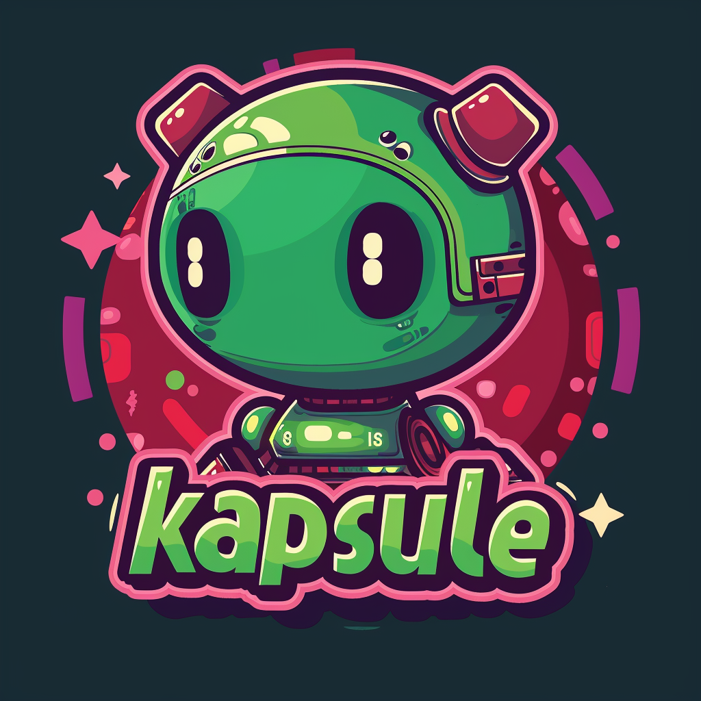

# Kapsule

[](./images/kapsule_logo.png)

Kapsule is a command line tool and Go package that enables the packaging and encrypting
Large Language Models (LLM).  Models are defined using the 
[OCI image format](https://github.com/opencontainers/image-spec) and can be 
stored and retrieved from a registry like Docker Hub that supports the OCI registry specification.

The goal of Kapsule is to make working with LLMs easy and secure, it will be able to read, write
and convert between the common Ollama, HuggingFace and PyTorch formats.

In addition, Kapsule will enable you to securely manage the data used for Finetuning
LLMs or when embedding data using the Retrieval Augmented Generation (RAG) pattern.

It is the goal of Kapsule to be easy to provide a similar workflow that developers are
already used to.


## Modelfile

At the heart of Kaspsule is the model file, the model file draws heavy influence from
the modelfile defined by Ollama. It is also familliar to developers who have been working
with Docker.

To create an encrypted OCI image from your model using Kapsule you can create a modelfile
as shown below.

```dockerfile
FROM ./dummy.gguf

TEMPLATE """[INST] {{ .System }} {{ .Prompt }} [/INST]"""

PARAMETER stop [/INST]
PARAMETER stop [INST]
PARAMETER temperature 1

SYSTEM You are brain from Pinky and the Brain, acting as an assitant.
```

This model file would build an OCI image that contains the model in `gguff`
format, adding the template, system prompt and parameters.

## Building images with Kapsule

To compose an image from the previous model the following command can be used.

```bash
# kapsule build -f <modelfile> <name> <context>
kapsule build \
  -f ./modelfile \
  hub.docker.io/nicholasjackson/mymodel:latest \
  .
```

This can then be pushed to any OCI compatible registry, the layers
of the image are encrypted using the given encryption key.

```bash
kapsule push \
  --encrypt-key ./key.pem \
  hub.docker.io/nicholasjackson/mymodel:latest
```

To pull an encrypted image and store it in the Ollama cache, you can run the 
opposite command `pull`.

```bash
kapsule pull \
  --encrypt-key ./key.pem \
  --output ./ollama_cache \
  --format ollama \
  hub.docker.io/nicholasjackson/mymodel:latest
```